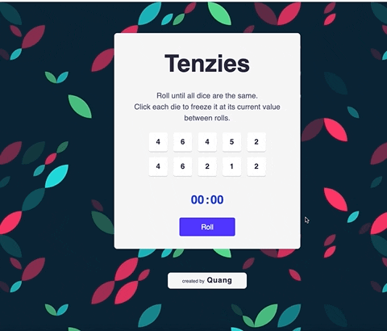

## React Tenzies Game

This is a project based on Scrimba's frontend developer career path

## Overview

The goal of this project was to practice `.useState()`, `.useEffect()`, `props`. 

Added additional stretch goals of a timer. Time starts when the first dice is held, and timer stops when all dice are held and have the same number.

### Screenshot

### Link 

- [Live Site](https://taupe-souffle-04c736.netlify.app/)

### Built with 

- CSS
- React
- NPM (react-confetti)